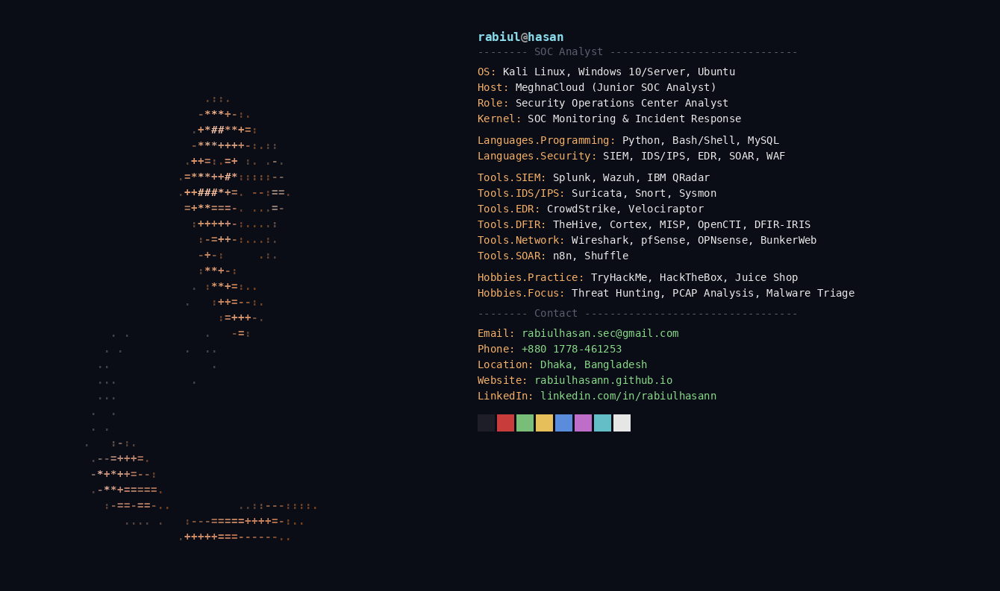

<h1 align="center">Hi, I'm Rabiul 👋</h1>
<h3 align="center">Security Operations Center (SOC) Analyst @ MeghnaCloud</h3>

  
  
  

---

### 🛡️ About Me

- 🔭 Currently working as a **Junior SOC Analyst** at **MeghnaCloud**, Dhaka
- 🧠 Focused on SIEM monitoring, alert triage, incident response, threat hunting, and SOC automation
- 🎓 B.Sc. in CSE @ Atish Dipankar University of Science & Technology (2023–Present)
- 📡 Building and integrating SOC stacks: TheHive, Cortex, MISP, OpenCTI, DFIR-IRIS, n8n, Shuffle
- 🐧 Comfortable across Kali Linux, Windows Server, and Ubuntu lab environments
- 📫 Reach me at **rabiulhasan.sec@gmail.com**

### 🧰 Tools & Technologies

**SIEM / IDS-IPS / EDR**

**DFIR / Threat Intel**

**Network / WAF**

**Scripting**

### 📊 GitHub Stats

  
  

### 🏅 Certifications

Fortinet NSE 1/2/3 · SIEM 101 (LetsDefend) · Web Attack Investigated (LetsDefend) · Ethical Hacker (Cisco) · Networking Essentials (Cisco) · Cyber Threat Intelligence 101 (arcX) · CTIGA (Red Team Leaders) · EDR Foundation (Qualys) · Vulnerability Management (Qualys) · ISC2 Candidate · NDG Linux Essentials
